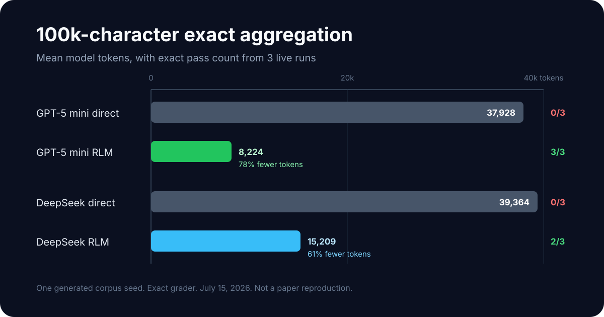

# Recursive Language Models (RLM)

[](https://github.com/grishahq/recursive-llm/actions/workflows/ci.yml)
[](https://www.python.org/)
[](LICENSE)
[](https://github.com/grishahq/recursive-llm/releases/latest)

Analyze large contexts with bounded cost and inspectable execution. Instead of placing the full
source in model prompts, RLM keeps it in a restricted Python REPL, where the model can search,
compute, partition, and send only selected sections to language-model calls.

This is an independent Python implementation of the
[Recursive Language Models paper](https://arxiv.org/abs/2512.24601), focused on practical library
use: provider portability, tree-wide budgets, structured failures, reproducible benchmarks, and
complete run trajectories.

[Quick start](#quick-start) | [Measured results](#measured-results) |
[Configuration](#configuration) | [Security](SECURITY.md) |
[Original implementation](https://github.com/alexzhang13/rlm)

## Why use this implementation?

| Capability | What it provides |
| --- | --- |
| Externalized context | Large source text stays in the REPL instead of being repeated in model prompts |
| Bounded execution | Tree-wide limits for calls, tokens, estimated cost, elapsed time, and local execution |
| Observable runs | Per-run statistics, typed failures, versioned JSONL records, and complete trajectories |
| Provider portability | OpenAI, Anthropic, DeepSeek, local models, and other LiteLLM providers |
| Reproducible evaluation | Exact graders, generated corpora, pinned public documents, and repeated live runs |
| Restricted execution | Spawned RestrictedPython worker with hard timeouts and optional POSIX resource limits |

## Measured results

The exact 100k-character aggregation benchmark used one generated corpus seed and three live runs
per configuration. On this task, RLM improved exact correctness while reducing model-token usage.



| Model and mode | Exact passes | Mean model tokens | Mean estimated cost |
| --- | ---: | ---: | ---: |
| GPT-5 mini, direct | 0/3 | 37,928 | $0.0088788 |
| GPT-5 mini, RLM | 3/3 | 8,224 | $0.0048132 |
| DeepSeek V4 Flash, direct | 0/3 | 39,364 | $0.0012240 |
| DeepSeek V4 Flash, RLM | 2/3 | 15,209 | $0.0010156 |

These measurements are an engineering check, not a paper reproduction or a universal quality
claim. Direct completion was faster and cheaper on short tasks. A separate 1M-character RLM scale
check passed 6/6 exact-graded runs, but those runs used local REPL computation without child RLMs.
See [BENCHMARK_RESULTS.md](BENCHMARK_RESULTS.md) for methodology, raw summaries, public-document
experiments, limitations, and reproduction commands.

## When to use RLM

RLM is a good fit when:

- the source is too large or too expensive to place in a normal model prompt;
- the task benefits from search, filtering, exact counting, or local Python computation;
- selected sections can be delegated to model calls instead of repeatedly sending the full source;
- call, token, cost, and time limits must apply to the whole recursive run.

Prefer direct completion when the context fits comfortably in the model window and the task is
small. Semantic synthesis across long narrative text remains difficult and should be evaluated on
your own data before production use.

## Execution at a glance

```text
query -> root model -> Python REPL over full context -> selected chunks or child calls -> answer
                       |                           |
                       +-- local search/compute   +-- shared budgets and trajectory
```

The root model receives the query and instructions, while the source is exposed as the `context`
variable. REPL state persists across iterations. The model can inspect small regions, perform local
computation, call a plain LM, or create a child RLM when the configured depth permits it.

## Installation

**Note:** This package is not yet published to PyPI. Install from source:

```bash
git clone https://github.com/grishahq/recursive-llm.git
cd recursive-llm
pip install -e .
```

Or install the current GitHub version directly:

```bash
pip install "recursive-llm @ git+https://github.com/grishahq/recursive-llm.git"
```

## Requirements

- Python 3.9 or higher
- An API key for your chosen LLM provider (OpenAI, Anthropic, etc.)
- Or a local model setup (Ollama, llama.cpp, etc.)

## Quick Start

Set the provider key, create `quickstart.py`, and point it at a UTF-8 text file:

```bash
export OPENAI_API_KEY="sk-..."
```

```python
from pathlib import Path

from rlm import RLM


def main():
    rlm = RLM(model="gpt-5-mini")

    result = rlm.complete_result(
        query="What are the main themes in this document?",
        context=Path("document.txt").read_text(encoding="utf-8"),
    )
    print(result.answer)
    print(result.stats)


if __name__ == "__main__":
    main()
```

```bash
python quickstart.py
```

RLM uses a spawned worker process for isolated REPL execution. Executable Python scripts must use
the standard `if __name__ == "__main__":` entry-point guard, as shown above. This is required by
Python multiprocessing on spawn-based platforms; all repository examples follow this pattern.

### Usage and Cost Statistics

`RLM.stats` aggregates model calls across the complete recursion tree. Token usage comes from
provider responses, while cost is calculated on a best-effort basis using LiteLLM's model pricing
metadata.

```python
rlm = RLM(
    model="gpt-5-mini",
    recursive_model="deepseek/deepseek-v4-flash",
)
result = rlm.complete(query="Summarize this", context=document)

print(rlm.stats)
# {
#     "llm_calls": 11,
#     "root_calls": 3,
#     "recursive_calls": 8,
#     "leaf_calls": 4,
#     "prompt_tokens": 12500,
#     "completion_tokens": 3200,
#     "cached_tokens": 6000,
#     "estimated_cost_usd": 0.0047,
#     "by_model": {
#         "gpt-5-mini": {"calls": 3, ...},
#         "deepseek/deepseek-v4-flash": {"calls": 8, ...},
#     },
# }
```

Each root completion receives fresh statistics, so they describe one recursion tree rather than
lifetime usage.
`estimated_cost_usd` is `None` when LiteLLM has no pricing metadata for any completed call. Compare
`priced_calls` with `llm_calls` before treating the estimate as the full run cost.

When the same `RLM` instance runs concurrent completions, `RLM.stats` describes whichever root run
completed most recently. Use the structured result API for exact per-run statistics and trajectory:

```python
result = rlm.complete_result(query="Summarize this", context=document)
print(result.answer)
print(result.stats)
for event in result.trajectory:
    print(event.kind, event.depth, event.node_id, event.parent_id)

# Append one complete, versioned run record for later comparison
result.write_jsonl("runs.jsonl")
```

`acomplete_result` is the asynchronous equivalent. Trajectories include the complete root, child
RLM, and leaf-call tree. Query, context, model response, code, and output content are represented by
character counts by default. Set `capture_trajectory_content=True` only when the resulting logs are
allowed to contain that data. An optional `event_handler` receives events as they occur; handler
failures do not interrupt model completion.

Use the non-raising result API when failed runs must be persisted or compared alongside successful
runs:

```python
run = rlm.try_complete_result(query="Summarize this", context=document)
if run.succeeded:
    print(run.answer)
else:
    print(run.error_type, run.error)

# Success and failure records share the same versioned JSONL schema.
run.write_jsonl("runs.jsonl")
```

`atry_complete_result` is the asynchronous equivalent. Ordinary run failures return a
`FailedCompletionResult` with exact per-run statistics, secret-free configuration, and the complete
partial trajectory, including its terminal `run_error` event. Cancellation and other process-control
exceptions are not converted. The existing `complete`, `acomplete`, `complete_result`, and
`acomplete_result` APIs keep their exception behavior.

Completed JSONL records contain the final answer; failed records contain `answer: null` and a typed
error. Query, context, intermediate model responses, code, and REPL output follow the same redaction
setting as the in-memory trajectory.

### Live Model Comparison

The comparison script uses the same model for both root and recursive calls. It runs one small
recursive smoke test by default and reports latency, calls, tokens, and estimated cost:

```bash
python benchmarks/compare_same_model.py gpt-5-mini
python benchmarks/compare_same_model.py deepseek/deepseek-v4-flash
```

Use repeated runs and save raw records before comparing configurations:

```bash
python benchmarks/compare_same_model.py gpt-5-mini --full --runs 3 --jsonl results.jsonl
python benchmarks/compare_same_model.py gpt-5-mini --full --runs 3 --mode direct
python benchmarks/compare_same_model.py gpt-5-mini --generated-chars 100000 --seed 2026
```

`--max-depth` compares recursion capabilities; `--mode direct` sends task and context in one normal
long-context model request. The script reports pass rate, p50/p95 latency, calls, tokens, and
best-effort cost. Task-specific graders require exact IDs, numeric boundaries, and explicit labeled
counts rather than accepting arbitrary substrings. Live benchmarks make paid API calls and require
the corresponding provider keys. `--trace` includes sensitive content-bearing trajectories in the
JSON output and should be used deliberately.

The repository also includes a SHA-pinned real-document benchmark over the public-domain English
translation of *War and Peace*. The book itself is downloaded separately and is not committed:

```bash
curl -L https://www.gutenberg.org/files/2600/2600-0.txt \
    -o /tmp/war-and-peace-2600-0.txt
python benchmarks/war_and_peace.py gpt-5-mini /tmp/war-and-peace-2600-0.txt
python benchmarks/war_and_peace.py deepseek/deepseek-v4-flash \
    /tmp/war-and-peace-2600-0.txt
```

`benchmarks/multi_document.py` extends this to three independently sourced large corpora: *War and
Peace*, the official 9/11 Commission Report, and the official Python 3.14 text documentation. It
verifies every prepared artifact by SHA-256 and uses exact labeled-field graders. Download and PDF
extraction commands, hashes, task definitions, and measured candidate results are in
[`BENCHMARK_RESULTS.md`](BENCHMARK_RESULTS.md).

## API Keys Setup

Copy the example environment file and add keys only for the providers you use:

```bash
cp .env.example .env
```

```dotenv
OPENAI_API_KEY=sk-...
DEEPSEEK_API_KEY=...
MOONSHOT_API_KEY=...
```

Use the LiteLLM provider prefix for non-OpenAI models, for example
`deepseek/deepseek-v4-flash` or `moonshot/kimi-k2.6`. This lets a hybrid RLM select the correct API
key for each model automatically.

Or pass directly in code:
```python
rlm = RLM(model="gpt-5-mini", api_key="sk-...")
```

## Supported Models

Works with 100+ LLM providers via LiteLLM:

```python
# OpenAI
rlm = RLM(model="gpt-5")
rlm = RLM(model="gpt-5-mini")

# Anthropic
rlm = RLM(model="claude-sonnet-4")
rlm = RLM(model="claude-sonnet-4-20250514")

# Ollama (local)
rlm = RLM(model="ollama/llama3.2")
rlm = RLM(model="ollama/mistral")

# llama.cpp (local)
rlm = RLM(
    model="openai/local",
    api_base="http://localhost:8000/v1"
)

# Azure OpenAI
rlm = RLM(model="azure/gpt-4-deployment")

# And many more via LiteLLM...
```

## Advanced Usage

### Two Models (Optimize Cost)

Use a cheaper model for recursive calls:

```python
rlm = RLM(
    model="gpt-5",              # Root LM (main decisions)
    recursive_model="gpt-5-mini"  # Recursive calls (cheaper)
)
```

### Async API

For better performance with parallel recursive calls:

```python
import asyncio

async def main():
    rlm = RLM(model="gpt-5-mini")
    result = await rlm.acomplete(query, context)
    print(result)

if __name__ == "__main__":
    asyncio.run(main())
```

### Configuration

```python
rlm = RLM(
    model="gpt-5-mini",
    max_depth=2,                 # One child RLM level, then a plain-LM fallback
    max_iterations=20,           # Maximum REPL iterations per RLM
    repl_timeout=5,              # Hard timeout for each local Python step
    max_output_chars=2000,       # Observation truncation limit
    max_concurrent_subcalls=4,   # Bound batch concurrency
    max_total_calls=24,          # Exact provider-call cap for the full recursion tree
    max_total_tokens=100_000,    # Stop after reported usage crosses this value
    max_total_cost_usd=0.10,     # Stop after reported cost crosses this value
    max_elapsed_seconds=300,     # Deadline shared by root and child calls
    max_retries=2,                # Retry transient provider failures; default is 0
    retry_backoff_seconds=1.0,   # Exponential retry delay; Retry-After is respected
    # Optional LiteLLM params: temperature, timeout, etc.
)
```

Call limits are reserved atomically before provider requests, including batched and recursive
subcalls. Token and cost limits are evaluated after each response because providers only report
those values after generation; the crossing response is included in partial statistics attached to
`BudgetExceededError`. A deadline also bounds in-flight provider requests. All limits are optional
and are reset for each root completion.

Retries are opt-in and share the same call and elapsed-time budgets as the rest of the recursion
tree. Every retry is counted as a provider call and recorded in statistics and trajectories.
RLM disables hidden LiteLLM retries to preserve exact accounting; configure `max_retries` on `RLM`
instead of passing `num_retries` or `max_retries` as a LiteLLM option. Null provider content is
normalized to an empty response so the existing repair iteration can recover, while malformed
response structures fail with `ProviderResponseError` or use the bounded retry path when enabled.

### Final Answer Validation

Applications can reject a syntactically valid final answer and give deterministic feedback to the
model without leaving the bounded run:

```python
def validate_answer(answer: str):
    if not answer.startswith("count="):
        return "Answer must start with 'count='."
    return None

rlm = RLM(
    model="gpt-5-mini",
    final_answer_validator=validate_answer,
)
```

The validator returns `None` to accept an answer or a non-empty error string to reject it. Rejected
answers and feedback are represented by lengths in redacted trajectories and by content only when
`capture_trajectory_content=True`. Validator exceptions abort the run as application errors.

`max_depth` is an explicit constructor option so that runs remain reproducible. It is not read from
an environment variable by the library. Applications may map their own configuration or environment
variables to this argument.

| `max_depth` | Behavior |
| ---: | --- |
| `0` | Root RLM and REPL only; no LM subcalls |
| `1` (default) | Root RLM may call a plain LM |
| `2` | Root RLM may create one child RLM; the child falls back to a plain LM |
| `n` | Adds one child RLM level for every increment above `1` |

This follows the paper's capability-based depth convention. The root RLM itself is depth `0` and is
still valid when `max_depth=0`.

### REPL Subcall API

The model can use these functions from its persistent REPL:

```python
# One plain LM call, without another REPL loop
llm_query("Extract the date", context[1000:2000])

# Child RLM when depth permits; otherwise one plain-LM boundary call
rlm_query("Analyze this section", context[2000:8000])

# Ordered parallel calls, limited by max_concurrent_subcalls
results = llm_query_batched(queries, chunks)
```

`recursive_llm` remains as a backward-compatible alias for `rlm_query`. A step can finish directly
through `FINAL(...)`, `FINAL_VAR(...)`, or the mutable `answer` object:

```python
answer["content"] = result
answer["ready"] = True
```

## How It Works

1. **Context is stored as a variable** in a Python REPL environment
2. **Root LM gets only the query** plus instructions
3. **LM can explore context** using Python code:
   ```python
   # Peek at context
   context[:1000]

   # Search with regex
   re.findall(r'pattern', context)

   # Recursive processing with a plain-LM boundary fallback
   rlm_query("extract dates", context[1000:2000])
   ```
4. **Returns the final answer** via a standalone `FINAL("answer")`, `FINAL_VAR(name)`, or `answer`
   publication

REPL variables persist between iterations. Each local step executes in an isolated subprocess, its
final expression is evaluated exactly once, print output is isolated per step, and non-terminating
local code is terminated by `repl_timeout`. Time spent waiting for model subcalls is not charged to
the local Python timeout. Imports are limited to the already exposed `re`, `json`, `math`,
`datetime`, and `collections` helpers; arbitrary modules remain blocked.

POSIX deployments may also opt in to worker-process limits:

```python
rlm = RLM(
    model="gpt-5-mini",
    repl_memory_limit_mb=512,
    repl_cpu_time_limit_seconds=10,
    repl_max_open_files=64,
)
```

These values depend on the runtime and workload, so the library does not guess defaults. A
configured limit that the platform cannot enforce fails worker startup explicitly. RestrictedPython
and a subprocess are defense-in-depth controls, not a security boundary for hostile code; read
[SECURITY.md](SECURITY.md) before processing untrusted prompts or contexts.

## Examples

See the `examples/` directory for complete working examples:
- `basic_usage.py` - Simple complete with OpenAI
- `ollama_local.py` - Using Ollama locally
- `two_models.py` - Cost optimization with two models
- `long_document.py` - Processing 50k+ token documents
- `data_extraction.py` - Extract structured data from text
- `multi_file.py` - Process multiple documents
- `custom_config.py` - Advanced configuration

Run an example:
```bash
# Set your API key first
export OPENAI_API_KEY="sk-..."

# Run example
python examples/basic_usage.py
```

## Performance

### Paper Results

On OOLONG benchmark (132k tokens):
- GPT-5: baseline
- RLM(GPT-5-Mini): **33% better than GPT-5** at similar cost

### Reproducible Project Benchmark

`benchmarks/compare_same_model.py` contains deterministic structured contexts with exact expected
answers. `benchmarks/generated_long_context.py` creates byte-reproducible transaction corpora with
seed, SHA-256 identity, and a computed answer key. Model outputs remain stochastic, so use `--runs`
and compare pass rate plus p50/p95 latency before drawing quality conclusions. See
[BENCHMARK_RESULTS.md](BENCHMARK_RESULTS.md) for the latest checked-in live comparison.

`benchmarks/war_and_peace.py` adds exact chapter counting, distant fact retrieval, and narrative
evidence synthesis over a verified 3.2-million-character real document.

## Development

```bash
# Clone repository
git clone https://github.com/grishahq/recursive-llm.git
cd recursive-llm

# Install with dev dependencies
pip install -e ".[dev]"

# Run tests, branch coverage, and the enforced coverage gate
pytest

# Type checking
mypy src/rlm

# Linting
ruff check src tests benchmarks examples

# Format code
black src tests examples benchmarks

# Build the source distribution and wheel
python -m build
```

GitHub Actions runs these gates across Python 3.9-3.12 on Linux, plus Python 3.12 on macOS and
Windows. It also installs the built wheel and runs the offline demo.

## Architecture

```
RLM
├── Core (async completion logic)
├── Run State (per-invocation budget, usage, and trajectory)
├── REPL Executor (restricted subprocess, persistent state, hard step timeout)
├── Prompt Builder (system prompts)
└── Parser (extract FINAL() answers)
```

Built on top of LiteLLM for universal LLM support.

## Limitations

- Python REPL steps are sequential; explicit batched LM/RLM subcalls can run concurrently
- No prefix caching (future enhancement)
- Recursion depth is limited (configurable via `max_depth`)
- No streaming support yet

## Troubleshooting

### "Max iterations exceeded"
- Increase `max_iterations` parameter
- Simplify your query
- Check if the model is getting stuck in a loop

### "API key not found"
- Copy `.env.example` to `.env` and set the appropriate provider variable:
  - `OPENAI_API_KEY` for OpenAI
  - `DEEPSEEK_API_KEY` for DeepSeek
  - `MOONSHOT_API_KEY` for Kimi
- Or pass `api_key` parameter to RLM constructor

### "Model not found"
- Check model name format for your provider
- See LiteLLM docs: https://docs.litellm.ai/docs/providers

### Using Ollama
- Make sure Ollama is running: `ollama serve`
- Pull a model first: `ollama pull llama3.2`
- Use model format: `ollama/model-name`

## Contributing

Contributions welcome! Please:
1. Fork the repository
2. Create a feature branch
3. Add tests for new features
4. Ensure all tests pass (`pytest tests/`)
5. Follow code style (use `black` and `ruff`)
6. Submit a pull request

## Citation

This implementation is based on the RLM paper by Alex L. Zhang, Tim Kraska, and Omar Khattab.

**To cite this implementation:**
```bibtex
@software{rlm_python,
  title = {recursive-llm: Python Implementation of Recursive Language Models},
  author = {Gvadzabia, Grisha},
  year = {2025},
  url = {https://github.com/grishahq/recursive-llm}
}
```

**To cite the original paper:**
```bibtex
@misc{zhang2025rlm,
  title = {Recursive Language Models},
  author = {Zhang, Alex L. and Kraska, Tim and Khattab, Omar},
  year = {2025},
  url = {https://arxiv.org/abs/2512.24601},
  eprint = {2512.24601},
  archivePrefix = {arXiv}
}
```

## License

MIT License - see LICENSE file for details

## Acknowledgments

Based on the Recursive Language Models paper by Alex L. Zhang, Tim Kraska, and Omar Khattab.

Built using:
- LiteLLM for universal LLM API support
- RestrictedPython for restricted code execution

## Links

- **Paper**: https://alexzhang13.github.io/blog/2025/rlm/
- **arXiv**: https://arxiv.org/abs/2512.24601
- **Official implementation**: https://github.com/alexzhang13/rlm
- **LiteLLM Docs**: https://docs.litellm.ai/
- **Changelog**: https://github.com/grishahq/recursive-llm/blob/main/CHANGELOG.md
- **Releases**: https://github.com/grishahq/recursive-llm/releases
- **Issues**: https://github.com/grishahq/recursive-llm/issues
